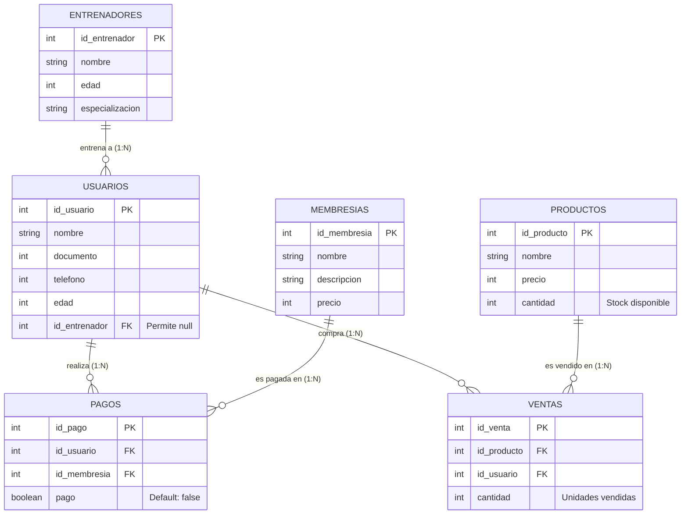

# 🏋️‍♂️ GymSoftWare - Servidor Backend para Gimnasios


**GymSoftWare** es una API RESTful desarrollada con **Node.js**, **Express** y el ORM **Sequelize** conectada a una base de datos **MySQL**. Proporciona una solución integral para la administración operativa y financiera de un centro deportivo o gimnasio, permitiendo gestionar clientes, entrenadores, membresías, pagos, inventario de productos y registro de ventas con control automatizado de stock.

El proyecto está diseñado bajo una sólida **Arquitectura en Capas (Layered Architecture)**, separando de manera estricta las responsabilidades de enrutamiento, control de flujo HTTP, lógica de negocio y persistencia de datos.

---

## 📑 Tabla de Contenidos

- [Características Principales](#-características-principales)
- [Arquitectura del Proyecto](#-arquitectura-del-proyecto)
- [Estructura del Repositorio](#-estructura-del-repositorio)
- [Modelo de Datos y Base de Datos](#-modelo-de-datos-y-base-de-datos)
  - [Diagrama Entidad - Relación](#diagrama-entidad---relación)
  - [Diccionario de Tablas](#diccionario-de-tablas)
- [Requisitos Previos](#-requisitos-previos)
- [Instalación y Configuración](#-instalación-y-configuración)
- [Ejecución del Servidor](#-ejecución-del-servidor)
- [Documentación de la API REST](#-documentación-de-la-api-rest)
  - [Resumen de Endpoints](#resumen-de-endpoints)
  - [1. Módulo de Usuarios (`/api/usuarios`)](#1-módulo-de-usuarios-apiusuarios)
  - [2. Módulo de Entrenadores (`/api/entrenadores`)](#2-módulo-de-entrenadores-apientrenadores)
  - [3. Módulo de Membresías (`/api/membresias`)](#3-módulo-de-membresías-apimembresias)
  - [4. Módulo de Pagos (`/api/pagos`)](#4-módulo-de-pagos-apipagos)
  - [5. Módulo de Productos (`/api/productos`)](#5-módulo-de-productos-apiproductos)
  - [6. Módulo de Ventas (`/api/ventas`)](#6-módulo-de-ventas-apiventas)
- [Manejo de Errores y Validaciones](#-manejo-de-errores-y-validaciones)
- [Guía de Pruebas con cURL](#-guía-de-pruebas-con-curl)
- [Autor y Licencia](#-autor-y-licencia)

---

## 🚀 Características Principales

- **Gestión de Clientes (Usuarios)**: Registro, consulta, edición y baja de socios del gimnasio con vinculación a su entrenador asignado.
- **Gestión de Entrenadores**: Catálogo de preparadores físicos con especificación de especialidad.
- **Gestión de Membresías**: Configuración de planes de entrenamiento con descripción y tarifas.
- **Control de Pagos**: Historial de cobros por membresías asociadas a usuarios específicos, con soporte de consultas cruzadas (eager loading de Usuario y Membresía).
- **Inventario de Productos**: Administración de catálogo de productos físicos (suplementos, bebidas, accesorios) con control de precios y existencias.
- **Gestión de Ventas con Lógica de Stock**:
  - Validación en tiempo real de existencia del producto y suficiencia de stock.
  - Reducción automática de unidades disponibles del inventario en cada venta.
- **Sincronización Automática ORM**: Creación y verificación de tablas en MySQL mediante `conn.sync()`.
- **Manejo Centralizado de Respuestas y Excepciones**: Respuestas JSON limpias para rutas no encontradas (404) y errores de servidor (500).

---

## 🏛️ Arquitectura del Proyecto

El sistema adopta el patrón de **Arquitectura en Capas**:

```
[ Cliente HTTP (Postman / Frontend / cURL) ]
                    │
                    ▼
          [ Middlewares Globales ]
        (express.json, 404, Error Handler)
                    │
                    ▼
          [ Capa de Rutas (routes) ]
         (Define endpoints y métodos HTTP)
                    │
                    ▼
      [ Capa de Controladores (controllers) ]
       (Extrae req.params, req.body y emite res)
                    │
                    ▼
       [ Capa de Servicios (services) ]
        (Aplica lógica y validaciones de negocio)
                    │
                    ▼
     [ Capa de Repositorios (repositories) ]
       (Consultas e inserciones con Sequelize)
                    │
                    ▼
         [ Capa de Modelos (models) ]
      (Esquemas Sequelize y Relaciones / FKs)
                    │
                    ▼
         [ Base de Datos (MySQL) ]
```

### Responsabilidades por Capa:
1. **Config (`src/config/`)**: Contiene las credenciales de conexión (`credentials.js`) y la instancia de Sequelize (`database.js`).
2. **Models (`src/models/`)**: Mapea los modelos relacionales mediante Sequelize y define las asociaciones de clave foránea en `Relaciones.js`.
3. **Repositories (`src/Repositories/`)**: Abstrae las consultas SQL/ORM (`findAll`, `findByPk`, `create`, `update`, `destroy`) e incluye las relaciones eager loading.
4. **Services (`src/services/`)**: Centraliza la lógica de negocio pura, validaciones de campos requeridos y operaciones complejas como el descuento de stock.
5. **Controllers (`src/controllers/`)**: Recibe peticiones HTTP, delega la acción al servicio y envía las respuestas con sus códigos de estado (200, 201, 400, 404, 500).
6. **Routes (`src/routes/`)**: Declara las URLs y vincula cada verbo HTTP al controlador correspondiente.
7. **Middlewares (`src/middlewares/`)**: Intercepta solicitudes para validación de datos y captura de errores.

---

## 📂 Estructura del Repositorio

```plaintext
GymSoftWare/
├── index.js                     # Punto de entrada principal y servidor Express
├── package.json                 # Metadatos del proyecto y dependencias
├── package-lock.json            # Bloqueo de versiones de dependencias
├── .gitignore                   # Archivos y carpetas ignoradas por Git
├── README.md                    # Documentación del proyecto
└── src/
    ├── config/
    │   ├── credentials.js       # Variables de configuración (puerto, BD, credenciales)
    │   └── database.js          # Instancia y configuración del ORM Sequelize
    ├── controllers/
    │   ├── ControllerEntrenadores.js
    │   ├── ControllerMembresias.js
    │   ├── ControllerPagos.js
    │   ├── ControllerProductos.js
    │   ├── ControllerUsuarios.js
    │   └── ControllerVentas.js
    ├── middlewares/
    │   ├── ErrorMiddleware.js        # Manejador global 404 y errores 500
    │   ├── ValidationMiddleware.js   # Middleware de validación con Joi
    │   └── schemas/
    │       └── Esquemas.js           # Reglas de validación para cada entidad
    ├── models/
    │   ├── ModelEntrenadores.js
    │   ├── ModelMembresias.js
    │   ├── ModelPagos.js
    │   ├── ModelProductos.js
    │   ├── ModelUsuarios.js
    │   ├── ModelVentas.js
    │   └── Relaciones.js             # Definición de asociaciones y claves foráneas
    ├── Repositories/
    │   ├── RepositoryEntrenadores.js
    │   ├── RepositoryMembresias.js
    │   ├── RepositoryPagos.js
    │   ├── RepositoryProductos.js
    │   ├── RepositoryUsuarios.js
    │   └── RepositoryVentas.js
    ├── routes/
    │   ├── RouteEntrenadores.js
    │   ├── RouteMembresias.js
    │   ├── RoutePagos.js
    │   ├── RouteProductos.js
    │   ├── RouteUsuarios.js
    │   ├── RouteVentas.js
    │   └── index.js             # Agregador central de todas las rutas bajo /api
    └── services/
        ├── ServiceEntrenadores.js
        ├── ServiceMembresias.js
        ├── ServicePagos.js
        ├── ServiceProductos.js
        ├── ServiceUsuarios.js
        └── ServiceVentas.js
```

---

## 🗄️ Modelo de Datos y Base de Datos

### Diagrama Entidad - Relación



### Diccionario de Tablas

#### 1. Tabla `usuarios`
| Campo | Tipo | Restricciones | Descripción |
| :--- | :--- | :--- | :--- |
| `id_usuario` | `INTEGER` | PK, Auto-increment | Identificador único del usuario |
| `nombre` | `STRING` | NOT NULL | Nombre completo del usuario |
| `documento` | `INTEGER` | NOT NULL | Documento de identidad |
| `telefono` | `INTEGER` | NOT NULL | Número de contacto |
| `edad` | `INTEGER` | NOT NULL | Edad en años |
| `id_entrenador`| `INTEGER` | FK (nullable) | Entrenador asignado |

#### 2. Tabla `entrenadores`
| Campo | Tipo | Restricciones | Descripción |
| :--- | :--- | :--- | :--- |
| `id_entrenador` | `INTEGER` | PK, Auto-increment | Identificador único del entrenador |
| `nombre` | `STRING` | NOT NULL | Nombre completo del entrenador |
| `edad` | `INTEGER` | NOT NULL | Edad del entrenador |
| `especializacion` | `STRING` | NOT NULL | Área de especialización (ej. Crossfit, Hipertrofia) |

#### 3. Tabla `membresias`
| Campo | Tipo | Restricciones | Descripción |
| :--- | :--- | :--- | :--- |
| `id_membresia` | `INTEGER` | PK, Auto-increment | Identificador único de la membresía |
| `nombre` | `STRING` | NOT NULL | Nombre del plan (ej. Mensualidad Gold) |
| `descripcion` | `STRING` | NOT NULL | Beneficios o alcance del plan |
| `precio` | `INTEGER` | NOT NULL | Costo de la membresía |

#### 4. Tabla `pagos`
| Campo | Tipo | Restricciones | Descripción |
| :--- | :--- | :--- | :--- |
| `id_pago` | `INTEGER` | PK, Auto-increment | Identificador único del pago |
| `id_usuario` | `INTEGER` | FK, NOT NULL | Usuario que efectúa el pago |
| `id_membresia` | `INTEGER` | FK, NOT NULL | Membresía adquirida |
| `pago` | `BOOLEAN` | NOT NULL, DEFAULT `false` | Estado del pago (`true` = pagado, `false` = pendiente) |

#### 5. Tabla `productos`
| Campo | Tipo | Restricciones | Descripción |
| :--- | :--- | :--- | :--- |
| `id_producto` | `INTEGER` | PK, Auto-increment | Identificador único del producto |
| `nombre` | `STRING` | NOT NULL | Nombre del artículo (ej. Proteína Whey 2lb) |
| `precio` | `INTEGER` | NOT NULL | Precio de venta unitario |
| `cantidad` | `INTEGER` | NOT NULL | Existencias disponibles en inventario |

#### 6. Tabla `ventas`
| Campo | Tipo | Restricciones | Descripción |
| :--- | :--- | :--- | :--- |
| `id_venta` | `INTEGER` | PK, Auto-increment | Identificador único de la venta |
| `id_producto` | `INTEGER` | FK, NOT NULL | Producto vendido |
| `id_usuario` | `INTEGER` | FK, NOT NULL | Usuario que realizó la compra |
| `cantidad` | `INTEGER` | NOT NULL | Cantidad de unidades adquiridas |

---

## 💻 Requisitos Previos

Antes de comenzar, asegúrate de contar con lo siguiente instalado en tu entorno de desarrollo:

- **Node.js**: Versión 18.x o superior ([Descargar Node.js](https://nodejs.org/))
- **NPM**: Gestor de paquetes incluido con Node.js
- **Servidor MySQL**: MySQL 5.7+ o 8.x (mediante XAMPP, WampServer, Laragon, MySQL Community Server o Docker)
- **Cliente de Base de Datos (Opcional pero recomendado)**: MySQL Workbench, DBeaver, phpMyAdmin o TablePlus

---

## ⚙️ Instalación y Configuración

### 1. Clonar el Repositorio

```bash
git clone https://github.com/Galvis588/GymSoftWare.git
cd GymSoftWare
```

### 2. Instalar Dependencias

Ejecuta el siguiente comando para instalar las librerías necesarias:

```bash
npm install
```

> **Nota:** Si deseas utilizar las validaciones de esquemas con Joi implementadas en `src/middlewares/ValidationMiddleware.js`, instala `joi`:
> ```bash
> npm install joi
> ```

### 3. Crear la Base de Datos en MySQL

Inicia tu servidor MySQL y crea la base de datos `G-training`:

```sql
CREATE DATABASE IF NOT EXISTS `G-training` DEFAULT CHARACTER SET utf8mb4 COLLATE utf8mb4_unicode_ci;
```

### 4. Configurar Parámetros de Conexión

Verifica o ajusta tus credenciales de base de datos en [src/config/credentials.js](src/config/credentials.js):

```javascript
export const DB_NAME = "G-training";
export const DB_USER = "root";          // Tu usuario de MySQL
export const DB_PASSWORD = "";          // Tu contraseña de MySQL
export const OBJ_CONN = {
    port: 3306,                         // Puerto de MySQL (3306 por defecto)
    host: "localhost",
    dialect: "mysql",
};

export const PORT_SERVER = 3000;
export const HOST_SERVER = "http://localhost:";
```

> **Nota sobre Sequelize:** El servidor incluye la instrucción `conn.sync()` en `index.js`. Esto significa que al conectarse por primera vez, **Sequelize creará automáticamente las tablas y sus relaciones** si aún no existen en la base de datos.

---

## 🏃 Ejecución del Servidor

### Modo Desarrollo (con recarga automática mediante Nodemon):

```bash
npm run dev
```

### Modo Producción:

```bash
npm start
```
*(O directamente: `node index.js`)*

### Salida esperada en consola:

```
Conexión establecida con la base de datos
Base de datos sincronizada correctamente
Servidor funcionando de forma correcta en http://localhost:3000
```

---

## 📡 Documentación de la API REST

**URL Base:** `http://localhost:3000/api`  
**Encabezado HTTP requerido para peticiones POST y PUT:**  
`Content-Type: application/json`

### Resumen de Endpoints

| Método | Endpoint | Descripción |
| :--- | :--- | :--- |
| **GET** | `/api/usuarios` | Lista todos los usuarios con su entrenador |
| **GET** | `/api/usuarios/:id` | Obtiene un usuario específico por ID |
| **POST** | `/api/usuarios` | Registra un nuevo usuario |
| **PUT** | `/api/usuarios/:id` | Actualiza los datos de un usuario |
| **DELETE** | `/api/usuarios/:id` | Elimina un usuario |
| **GET** | `/api/entrenadores` | Lista todos los entrenadores |
| **GET** | `/api/entrenadores/:id` | Obtiene un entrenador específico |
| **POST** | `/api/entrenadores` | Registra un nuevo entrenador |
| **PUT** | `/api/entrenadores/:id` | Actualiza datos de un entrenador |
| **DELETE** | `/api/entrenadores/:id` | Elimina un entrenador |
| **GET** | `/api/membresias` | Lista todas las membresías disponibles |
| **GET** | `/api/membresias/:id` | Obtiene una membresía por ID |
| **POST** | `/api/membresias` | Crea una nueva membresía |
| **PUT** | `/api/membresias/:id` | Modifica una membresía |
| **DELETE** | `/api/membresias/:id` | Elimina una membresía |
| **GET** | `/api/pagos` | Lista todos los pagos con usuario y membresía |
| **GET** | `/api/pagos/:id` | Obtiene un pago por ID |
| **POST** | `/api/pagos` | Registra un pago de membresía |
| **PUT** | `/api/pagos/:id` | Actualiza un pago (ej. marcar como pagado) |
| **DELETE** | `/api/pagos/:id` | Elimina un registro de pago |
| **GET** | `/api/productos` | Lista todos los productos en inventario |
| **GET** | `/api/productos/:id` | Obtiene un producto por ID |
| **POST** | `/api/productos` | Agrega un nuevo producto con stock |
| **PUT** | `/api/productos/:id` | Actualiza información o stock de un producto |
| **DELETE** | `/api/productos/:id` | Elimina un producto |
| **GET** | `/api/ventas` | Lista todas las ventas con producto y usuario |
| **GET** | `/api/ventas/:id` | Obtiene el detalle de una venta por ID |
| **POST** | `/api/ventas` | Registra una venta y descuenta stock automáticamente |
| **PUT** | `/api/ventas/:id` | Actualiza un registro de venta |
| **DELETE** | `/api/ventas/:id` | Elimina una venta |

---

### 1. Módulo de Usuarios (`/api/usuarios`)

#### 🔹 `GET /api/usuarios`
Obtiene el listado de usuarios con la información del entrenador asociado (`include: Entrenador`).

**Respuesta Exitosa (200 OK):**
```json
[
  {
    "id_usuario": 1,
    "nombre": "Carlos Perez",
    "documento": 1020304050,
    "telefono": 3123456789,
    "edad": 28,
    "id_entrenador": 1,
    "Entrenador": {
      "id_entrenador": 1,
      "nombre": "Julian Gomez",
      "edad": 35,
      "especializacion": "Fuerza y Acondicionamiento"
    }
  }
]
```

#### 🔹 `GET /api/usuarios/:id`
Obtiene un único usuario por su ID primario.

**Respuesta Si No Existe (404 Not Found):**
```json
{
  "mensaje": "Usuario no encontrado"
}
```

#### 🔹 `POST /api/usuarios`
Registra un nuevo usuario en la base de datos.

**Cuerpo de la Petición (JSON):**
```json
{
  "nombre": "Carlos Perez",
  "documento": 1020304050,
  "telefono": 3123456789,
  "edad": 28,
  "id_entrenador": 1
}
```

**Respuesta Exitosa (201 Created):**
```json
{
  "id_usuario": 1,
  "nombre": "Carlos Perez",
  "documento": 1020304050,
  "telefono": 3123456789,
  "edad": 28,
  "id_entrenador": 1
}
```

#### 🔹 `PUT /api/usuarios/:id`
Actualiza uno o varios campos del usuario indicado.

**Cuerpo de la Petición (JSON):**
```json
{
  "telefono": 3001112233,
  "edad": 29
}
```

**Respuesta Exitosa (200 OK):** Objeto con los datos actualizados.

#### 🔹 `DELETE /api/usuarios/:id`
Elimina al usuario especificado.

**Respuesta Exitosa (200 OK):**
```json
{
  "mensaje": "Usuario eliminado correctamente"
}
```

---

### 2. Módulo de Entrenadores (`/api/entrenadores`)

#### 🔹 `POST /api/entrenadores`
Registra un nuevo preparador físico.

**Cuerpo de la Petición (JSON):**
```json
{
  "nombre": "Julian Gomez",
  "edad": 35,
  "especializacion": "Fuerza y Acondicionamiento"
}
```

**Respuesta Exitosa (201 Created):**
```json
{
  "id_entrenador": 1,
  "nombre": "Julian Gomez",
  "edad": 35,
  "especializacion": "Fuerza y Acondicionamiento"
}
```

#### 🔹 `GET /api/entrenadores`
Retorna todos los entrenadores registrados (200 OK).

#### 🔹 `GET /api/entrenadores/:id`
Retorna el entrenador indicado o `404 Not Found` si no existe.

#### 🔹 `PUT /api/entrenadores/:id`
Modifica nombre, edad o especialización del entrenador.

#### 🔹 `DELETE /api/entrenadores/:id`
Elimina el registro del entrenador.

---

### 3. Módulo de Membresías (`/api/membresias`)

#### 🔹 `POST /api/membresias`
Registra una nueva membresía o paquete de suscripción.

**Cuerpo de la Petición (JSON):**
```json
{
  "nombre": "Membresía Black Anual",
  "descripcion": "Acceso ilimitado a todas las sedes, zona húmeda y clases grupales",
  "precio": 1200000
}
```

**Respuesta Exitosa (201 Created):**
```json
{
  "id_membresia": 1,
  "nombre": "Membresía Black Anual",
  "descripcion": "Acceso ilimitado a todas las sedes, zona húmeda y clases grupales",
  "precio": 1200000
}
```

#### 🔹 `GET /api/membresias`
Retorna la lista de todas las membresías activas.

---

### 4. Módulo de Pagos (`/api/pagos`)

Gestiona los pagos de membresías realizados por los usuarios. Incluye los modelos `Usuario` y `Membresia` en sus respuestas GET.

#### 🔹 `POST /api/pagos`
Crea una orden o comprobante de pago.

**Cuerpo de la Petición (JSON):**
```json
{
  "id_usuario": 1,
  "id_membresia": 1,
  "pago": true
}
```

**Respuesta Exitosa (201 Created):**
```json
{
  "id_pago": 1,
  "id_usuario": 1,
  "id_membresia": 1,
  "pago": true
}
```

#### 🔹 `GET /api/pagos`
Retorna todos los pagos incluyendo los datos completos del socio y del plan adquirido:

```json
[
  {
    "id_pago": 1,
    "id_usuario": 1,
    "id_membresia": 1,
    "pago": true,
    "Usuario": {
      "id_usuario": 1,
      "nombre": "Carlos Perez",
      "documento": 1020304050
    },
    "Membresia": {
      "id_membresia": 1,
      "nombre": "Membresía Black Anual",
      "precio": 1200000
    }
  }
]
```

---

### 5. Módulo de Productos (`/api/productos`)

Controla los productos comercializados en el gimnasio (suplementos, hidratación, accesorios).

#### 🔹 `POST /api/productos`
Añade un producto al inventario.

**Cuerpo de la Petición (JSON):**
```json
{
  "nombre": "Proteína Whey Isolate 2lb",
  "precio": 185000,
  "cantidad": 25
}
```

**Respuesta Exitosa (201 Created):**
```json
{
  "id_producto": 1,
  "nombre": "Proteína Whey Isolate 2lb",
  "precio": 185000,
  "cantidad": 25
}
```

#### 🔹 `GET /api/productos`
Lista todos los productos y existencias disponibles.

---

### 6. Módulo de Ventas (`/api/ventas`)

> ⚡ **Lógica de Negocio Especial:**  
> Al registrar una venta vía `POST /api/ventas`, `ServiceVentas` realiza las siguientes comprobaciones de forma atómica:
> 1. Valida que los campos `id_producto`, `id_usuario` y `cantidad` existan.
> 2. Verifica en la base de datos que el producto exista. Si no existe, lanza error: `"El producto indicado no existe"`.
> 3. Comprueba que el stock disponible sea mayor o igual a la cantidad vendida (`producto.cantidad < datos.cantidad`). Si no hay existencias suficientes, rechaza la operación con error: `"No hay stock suficiente para esta venta"`.
> 4. Si todo es correcto, registra la venta y **descuenta inmediatamente las unidades vendidas del stock del producto** (`cantidad = producto.cantidad - datos.cantidad`).

#### 🔹 `POST /api/ventas`
Registra una nueva venta.

**Cuerpo de la Petición (JSON):**
```json
{
  "id_producto": 1,
  "id_usuario": 1,
  "cantidad": 2
}
```

**Respuesta Exitosa (201 Created):**
```json
{
  "id_venta": 1,
  "id_producto": 1,
  "id_usuario": 1,
  "cantidad": 2
}
```

**Respuesta por Falta de Stock (400 Bad Request):**
```json
{
  "mensaje": "Error al crear la venta",
  "error": "No hay stock suficiente para esta venta"
}
```

#### 🔹 `GET /api/ventas`
Lista todas las ventas con los objetos completos de `Producto` y `Usuario` asociados (`include: [Producto, Usuario]`).

---

## 🛡️ Manejo de Errores y Validaciones

### 1. Rutas No Encontradas (404)
Cualquier petición a una URL o método HTTP no definido es capturada por el middleware `rutaNoEncontrada`:

```json
{
  "mensaje": "Ruta no encontrada: GET /api/no-existe"
}
```

### 2. Errores No Controlados (500)
Las excepciones no controladas pasan al middleware central `manejarErrores`, registrando el error en consola y devolviendo:

```json
{
  "mensaje": "Ocurrió un error inesperado en el servidor",
  "error": "Mensaje detallado del error"
}
```

### 3. Middleware de Validación con Joi (`ValidationMiddleware.js`)
El proyecto cuenta con un middleware transversal que permite interceptar peticiones y validar el `req.body` con esquemas Joi (`src/middlewares/schemas/Esquemas.js`), retornando reportes acumulados de error si los tipos de datos o campos no coinciden:

```json
{
  "mensaje": "Error de validación en los datos enviados",
  "errores": [
    "\"nombre\" is required",
    "\"edad\" must be greater than or equal to 18"
  ]
}
```

---

## 🧪 Guía de Pruebas con cURL

A continuación tienes comandos de prueba listos para copiar y ejecutar en tu terminal:

### 1. Crear un Entrenador
```bash
curl -X POST http://localhost:3000/api/entrenadores \
  -H "Content-Type: application/json" \
  -d "{\"nombre\":\"Julian Gomez\",\"edad\":35,\"especializacion\":\"Hipertrofia\"}"
```

### 2. Crear un Usuario asignado al Entrenador 1
```bash
curl -X POST http://localhost:3000/api/usuarios \
  -H "Content-Type: application/json" \
  -d "{\"nombre\":\"Carlos Perez\",\"documento\":1020304050,\"telefono\":3123456789,\"edad\":28,\"id_entrenador\":1}"
```

### 3. Consultar todos los Usuarios con su Entrenador
```bash
curl -X GET http://localhost:3000/api/usuarios
```

### 4. Crear un Producto en Inventario
```bash
curl -X POST http://localhost:3000/api/productos \
  -H "Content-Type: application/json" \
  -d "{\"nombre\":\"BCAA 400g Aminoacidos\",\"precio\":95000,\"cantidad\":15}"
```

### 5. Registrar una Venta (Descuento automático de stock)
```bash
curl -X POST http://localhost:3000/api/ventas \
  -H "Content-Type: application/json" \
  -d "{\"id_producto\":1,\"id_usuario\":1,\"cantidad\":3}"
```

### 6. Verificar el Stock restante del Producto
```bash
curl -X GET http://localhost:3000/api/productos/1
```

---

## 👨‍💻 Autor y Licencia

- **Desarrollador:** Andrés Galvis ([@Galvis588](https://github.com/Galvis588))
- **Licencia:** Distribuido bajo la Licencia **ISC**. Consulta el archivo `package.json` para más detalles.

---

> 💡 *Desarrollado con buenas prácticas, arquitectura limpia y código modular para escalabilidad y mantenimiento eficiente.*
